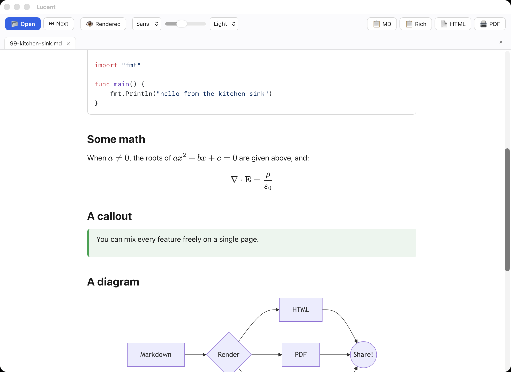

# Lucent

**A clear, fast, native viewer for Markdown and structured text files.**

Lucent opens a file and renders it into a clean, readable document — with rich
Markdown, syntax-highlighted code, diagrams, and math — then gets out of your
way. It's a desktop app (built with [Tauri](https://tauri.app/), so it ships as
a small native binary, not a browser tab) that's fast to launch and pleasant to
read in.



> **Status:** v0.1 — Markdown viewer. Lucent is being built toward a general
> *multi-format* viewer (see [Roadmap](#roadmap)). The name and architecture are
> deliberately format-agnostic so logs, JSON/YAML/TOML, and HTML can join without
> a rename.

---

## Features (v0.1)

- **Rich Markdown rendering** — GitHub-flavored Markdown with tables, task lists,
  footnotes, definition lists, emoji, and admonition blocks (note / warning / tip).
- **Code blocks done right** — syntax highlighting (highlight.js), a filename/
  language header, one-click **copy** and **save-to-file**, and toggleable,
  click-to-highlight **line numbers** that always stay aligned.
- **Diagrams & math** — [Mermaid](https://mermaid.js.org/) diagrams and
  [KaTeX](https://katex.org/) math render inline.
- **Tabs & multi-open** — open many files at once, page through a folder with
  **Next**, or launch from the shell: `lucent *.md`.
- **Live reload** — edits on disk refresh the view automatically (scroll preserved).
- **Raw ⇄ rendered** toggle, drag-and-drop, and a plain-text mode for any
  non-Markdown file.
- **Adjustable & persistent** — font family, size, and **light / sepia / dark**
  theme (code and diagrams follow the theme), all remembered between launches.
- **Export & copy** — one-click **PDF** (native, fixed A4 page) and
  **standalone HTML** (fully self-contained), plus copy the document as Markdown
  or as rich text (paste into Docs/Confluence/Word with formatting intact).
- **Private by design** — `markdown-it` runs with raw-HTML passthrough disabled,
  links are scheme-allowlisted, and all filesystem access goes through a small
  audited Rust layer.

See the [`examples/`](examples/) folder for a tour of everything Lucent renders.
Sample outputs from the kitchen-sink example:
[HTML export](docs/99-kitchen-sink.html) · [PDF export](docs/99-kitchen-sink.pdf).

## Roadmap

Lucent's direction is a **viewer for the structured text files you actually open
all day**, each rendered the way it deserves:

- **Logs** with smart options — decode embedded base64 / encoded JSON inline,
  highlight levels, fold noise.
- **JSON / YAML / TOML** rendered as a navigable, collapsible tree.
- **HTML** rendered safely.
- **Edit mode** — opt-in editing with live preview, so Lucent reads *and* writes
  when you want it to (without becoming an editor-first app).

## Install / Run

Requires [Node.js](https://nodejs.org/) and the
[Rust toolchain](https://www.rust-lang.org/tools/install) (for Tauri).

```bash
npm install
npm run tauri dev      # run in development
npm run tauri build    # produce a native app bundle (.app / .dmg on macOS)
```

### Tests

```bash
npm test                       # frontend (Vitest)
cd src-tauri && cargo test     # backend (Rust)
```

## Tech

Tauri 2 (Rust backend + system webview) · TypeScript + Vite frontend ·
markdown-it · highlight.js · Mermaid · KaTeX.

## License

[Apache-2.0](LICENSE) © Jacob Verhoeks
