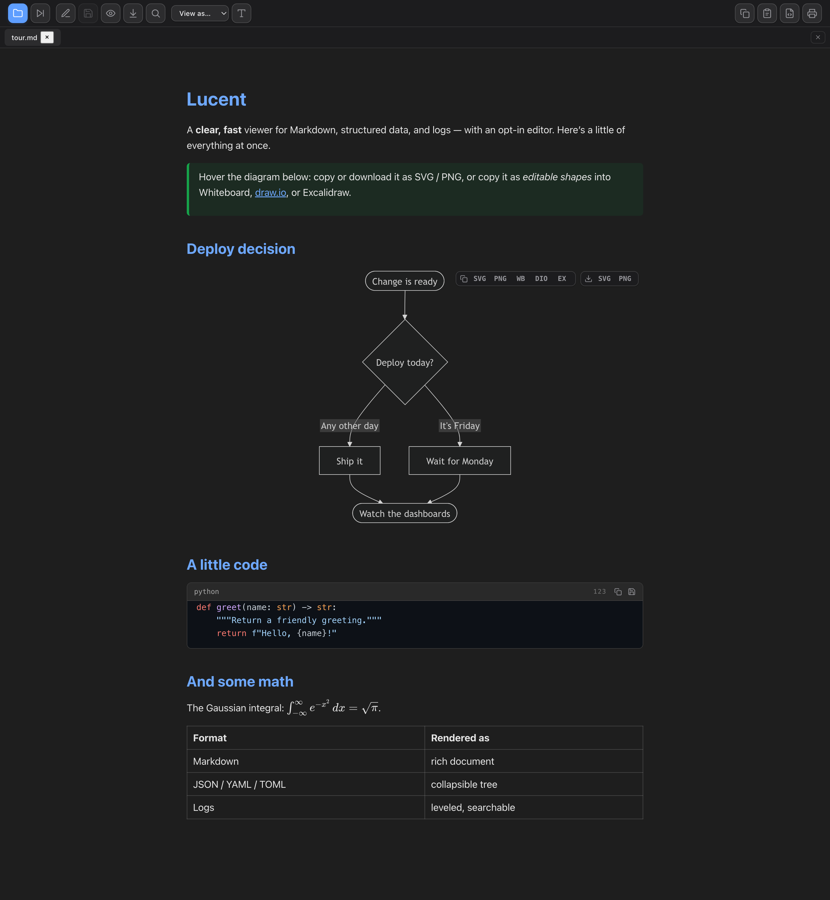

# Lucent

**A clear, fast, native viewer for Markdown, structured data, and logs.**

Lucent opens a file and renders it into a clean, readable document — rich
Markdown, syntax-highlighted code, diagrams, math, JSON/YAML/TOML/INI trees,
and logs — then gets out of your way. It's a desktop app (built with
[Tauri](https://tauri.app/), so it ships as a small native binary, not a
browser tab) that's fast to launch and pleasant to read in, with an opt-in
split-screen editor for when you want to write too.



> **Status:** v0.4 — a multi-format viewer with editing. Markdown, structured
> data (JSON / YAML / TOML / INI), and logs all render the way they deserve.
> Runs as a native desktop app and as a zero-install web build.

---

## Features

- **Rich Markdown rendering** — GitHub-flavored Markdown with tables, task lists,
  footnotes, definition lists, emoji, local images, and admonition blocks
  (note / warning / tip).
- **Code blocks done right** — syntax highlighting (highlight.js), a filename/
  language header, one-click **copy** and **save-to-file**, and toggleable,
  click-to-highlight **line numbers** that always stay aligned.
- **Diagrams & math** — [Mermaid](https://mermaid.js.org/) diagrams and
  [KaTeX](https://katex.org/) math render inline, and follow the theme.
- **Mermaid diagrams you can take with you** — hover any diagram for a toolbar:
  **copy**, **edit the source**, **download**, or export every diagram as
  draw.io XML; copy editable shapes straight into
  [Atlassian Whiteboard](https://www.atlassian.com/software/confluence/whiteboards),
  [draw.io](https://www.drawio.com/), Lucidchart, or [Excalidraw](https://excalidraw.com/) -
  native shapes, text, and connectors, not a flat image. See
  [Copy & export](docs/copy-and-export.md).
- **Structured data as a tree** — JSON, YAML, TOML, and INI render as a
  navigable, collapsible tree instead of raw text. YAML, TOML, INI, and
  JSON-style `//` / `/* ... */` comments remain visible with their source line
  context.
- **Logs, made readable** — level highlighting, desktop tail / follow for live
  files, in-view search, and inline decoding of embedded (even base64-encoded)
  JSON.
- **Markdown and structured-data editor** — opt-in split-screen
  [CodeMirror](https://codemirror.net/) editing for Markdown and JSON / YAML /
  TOML / INI, with a live rendered preview or collapsible tree beside the
  source. Save with `Cmd/Ctrl+S`; invalid structured data stays editable and
  reports its parse error in the preview.
- **View as** — reinterpret any file on the fly: Markdown, plain text, or a
  JSON / YAML / TOML / INI tree, regardless of extension.
- **Tabs & multi-open** — open many files at once, page through a folder with
  **Next**, or launch from the shell: `lucent *.md`; tabs, scroll positions, and
  format overrides return after relaunch.
- **Document outline** — Markdown headings form a pinned, clickable outline
  without turning the headings themselves into links.
- **Live reload** — edits on disk refresh the view automatically (scroll preserved).
- **Raw ⇄ rendered** toggle, drag-and-drop, and a plain-text mode for any file.
- **Adjustable & persistent** — font family, size, and **light / sepia / dark**
  theme (code and diagrams follow the theme), plus **find** (`Cmd/Ctrl+F`) with
  case and regex, and quick switching across open/recent files (`Cmd/Ctrl+P`) —
  all remembered between launches.
- **Export & copy** — download **PDF** (native, fixed A4 page) and
  **standalone HTML** (fully self-contained) from the **Download as…** menu,
  plus copy the document as Markdown or as rich text (paste into Docs /
  Confluence / Word with formatting intact).
- **Download and convert as another type** — the desktop and web builds both
  provide **Download as…**. Export rendered content as Markdown, standalone
  HTML, or PDF, and convert structured files between JSON, YAML, TOML, and INI.
  Comments are preserved between comment-capable formats, including
  nonstandard JSON `//` and `/* ... */` comments. Same-format tree edits restore
  comments near their original lines. Desktop uses native Save dialogs; the
  browser downloads the result directly.
- **Opens `.md` for you** — registers as a `.md` file handler on the OS, so
  double-clicking a Markdown file opens it in Lucent.
- **Private by design** — `markdown-it` runs with raw-HTML passthrough disabled,
  links are scheme-allowlisted, and all filesystem access goes through a small
  audited Rust layer. Lucent has no analytics, crash reporting, or telemetry;
  the desktop app only contacts GitHub to check for signed updates.
- **Signed in-app updates** — desktop releases check for a newer GitHub Release,
  ask before downloading, verify its Tauri signature, install, and restart.

See the [`examples/`](examples/) folder for a tour of everything Lucent renders,
and [Copy & export](docs/copy-and-export.md) for every way to get content back
out. Sample outputs from the kitchen-sink example:
[HTML export](docs/99-kitchen-sink.html) · [PDF export](docs/99-kitchen-sink.pdf).

## Roadmap

- **HTML** rendered safely.

## Install / Run

On macOS, install via Homebrew:

```bash
brew tap jverhoeks/tap
brew install --cask lucent
```

Or build from source. Requires [Node.js](https://nodejs.org/) and the
[Rust toolchain](https://www.rust-lang.org/tools/install) (for Tauri).

```bash
npm install
npm run tauri dev      # run the desktop app in development
npm run tauri build    # produce a native app bundle (.app / .dmg on macOS)
npm run dev            # web build in the browser (Vite dev server)
npm run build:web      # static web bundle
```

### Release downloads

Each [GitHub Release](https://github.com/jverhoeks/lucent/releases/latest)
contains native installers for the following platforms:

| Platform | Architecture | Release files | Use |
| --- | --- | --- | --- |
| macOS | Universal (Apple Silicon + Intel) | `.dmg` | Open the disk image and drag Lucent to Applications. The same build is available through Homebrew. |
| Linux | x86_64 | `.deb`, `.rpm`, `.AppImage` | Use `.deb` for Debian/Ubuntu, `.rpm` for Fedora/RHEL-family systems, or the portable `.AppImage`. |
| Linux | ARM64 / aarch64 | `.deb`, `.rpm`, `.AppImage` | Native packages for ARM64 Linux machines. |
| Windows | x86_64 | `.msi`, NSIS setup `.exe` | Use either the Windows Installer package or the standard setup executable. |

The release also includes `latest.json` plus signed updater archives and `.sig`
files. Those are consumed by Lucent's in-app updater; they are not standalone
installers. macOS users can alternatively install or upgrade with:

```bash
brew tap jverhoeks/tap
brew install --cask lucent
brew upgrade --cask lucent
```

### Tests

```bash
npm test                       # frontend (Vitest)
cd src-tauri && cargo test     # backend (Rust)
```

## Tech

Tauri 2 (Rust backend + system webview) · TypeScript + Vite frontend ·
markdown-it · highlight.js · Mermaid · KaTeX · CodeMirror ·
yaml / smol-toml / ini for structured data.

## License

[Apache-2.0](LICENSE) © Jacob Verhoeks
