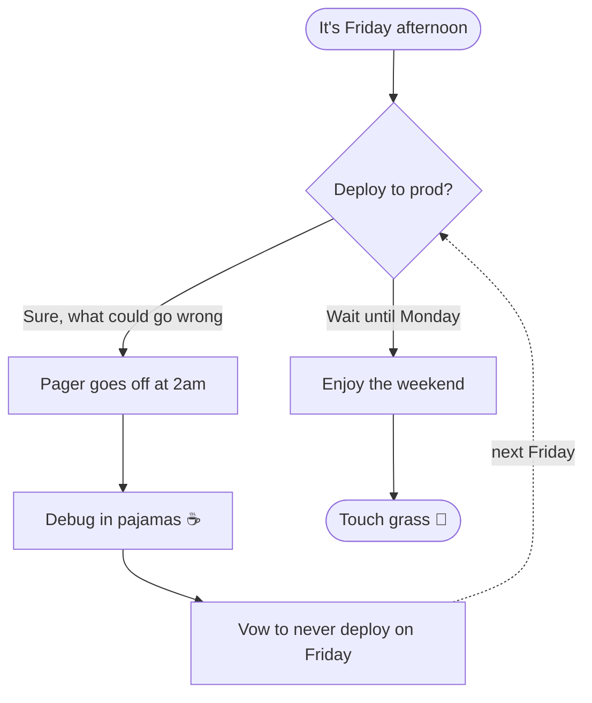
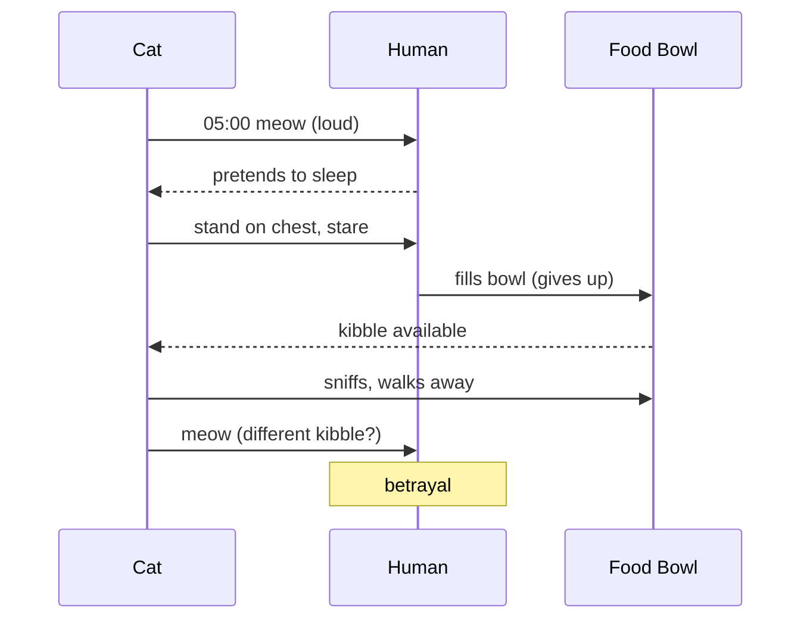
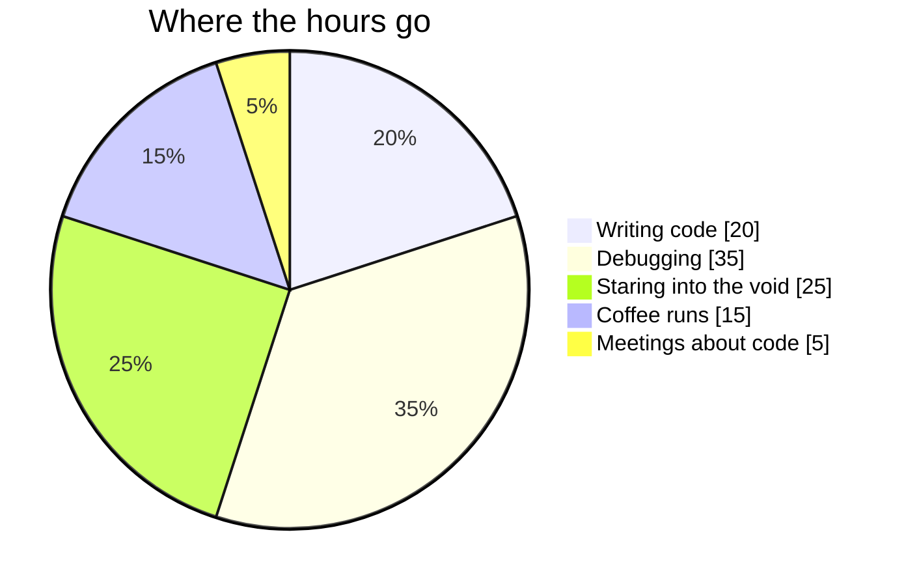
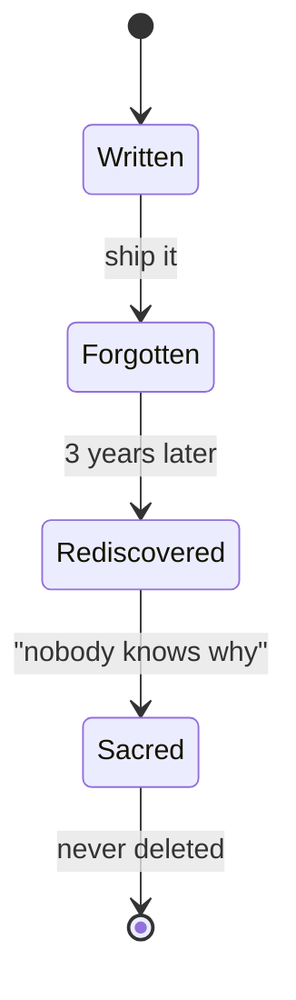

# Mermaid Diagrams

Diagrams render to SVG and follow the app theme (try switching to **Dark**).
Back to the [index](README.md).

## Flowchart — Should you deploy on Friday?

## Sequence — A cat negotiates dinner

## Pie — How a developer's day is spent

## State — The lifecycle of a TODO comment

## Gantt — Operation: Conquer the Couch (by a cat)

```mermaid
gantt
    title A cat's master plan
    dateFormat  HH:mm
    axisFormat  %H:%M
    section Morning
    Wake the human      :done,    a1, 05:00, 30m
    Demand breakfast    :done,    a2, after a1, 20m
    Nap on keyboard     :active,  a3, after a2, 3h
    section Afternoon
    Knock things off table :crit,  b1, 13:00, 45m
    Strategic napping      :        b2, after b1, 2h
```

