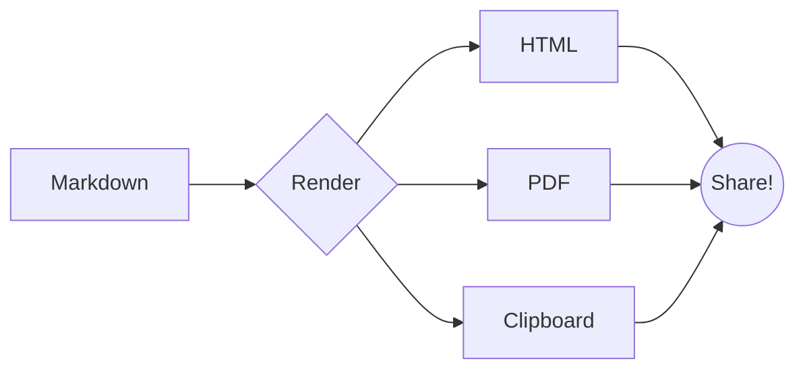

# Kitchen Sink :sparkles:

A bit of everything on one page. Back to the [index](README.md).

## Prose

A paragraph with **bold**, *italic*, ~~strike~~, `code`, an
[external link](https://tauri.app), and an in-page jump to the
[diagram](#a-diagram).

## A checklist

- [x] Headings
- [x] Code + highlighting
- [ ] Snacks

## Some code

```go
package main

import "fmt"

func main() {
    fmt.Println("hello from the kitchen sink")
}
```

## Some math

When $a \ne 0$, the roots of $ax^2 + bx + c = 0$ are given above, and:

$$
\nabla \cdot \mathbf{E} = \frac{\rho}{\varepsilon_0}
$$

## A callout

::: tip
You can mix every feature freely on a single page.
:::

## A diagram



## A table with a footnote

| Feature | Powered by |
|---------|------------|
| Diagrams | Mermaid[^m] |
| Math | KaTeX |

[^m]: Rendered as inline SVG by a post-render pass.

## Definition

Done
:   When the tests pass, the build is clean, and you've stopped tweaking.
