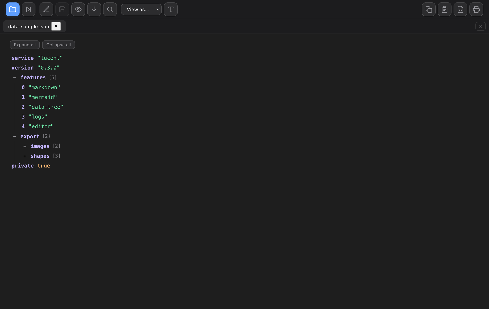
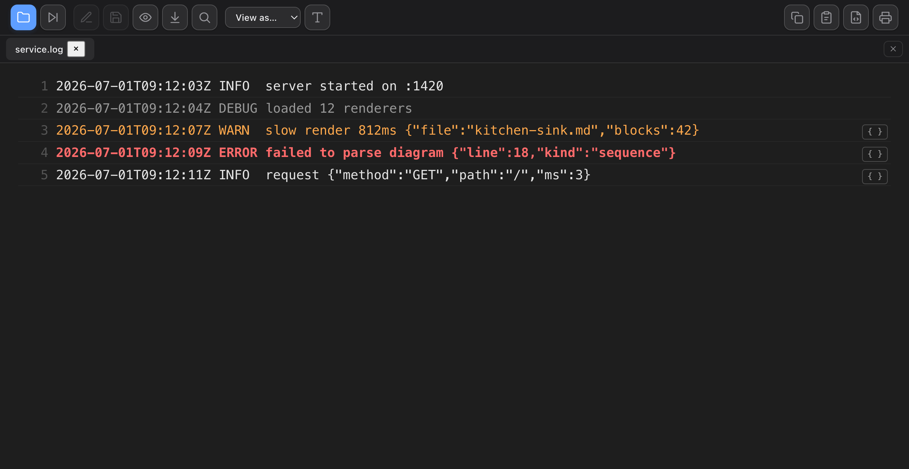

# Examples :books:

A tour of everything this viewer renders. Open any file below — these are
**relative links**, so clicking them opens the file in a new tab.

1. [Basics](01-basics.md) — headings, emphasis, lists, code, tables, quotes
2. [Links](02-links.md) — in-page anchors, external, relative, autolinks, email
3. [Task lists](03-task-lists.md) — GFM checkboxes
4. [Math](04-math.md) — KaTeX inline and display
5. [Mermaid diagrams](05-mermaid.md) — flowcharts, sequence, pie, gantt, state
6. [Footnotes](06-footnotes.md)
7. [Emoji](07-emoji.md)
8. [Definition lists](08-definition-lists.md)
9. [Callouts](09-callouts.md) — note / warning / tip
10. [Code highlighting](10-code-highlighting.md) — many languages
11. [Kitchen sink](99-kitchen-sink.md) — a bit of everything at once

External link, opens in your browser: [the Markdown spec](https://commonmark.org).

## Beyond Markdown

Lucent isn't only a Markdown viewer. These sample files show the other formats:

- **Structured data** — `data-sample.json`, `data-sample.yaml`, `data-sample.toml`,
  `data-sample.ini` render as a navigable, collapsible tree. Try **View as…** to
  reinterpret one as another format, or (in the web build) **Download as…** to
  convert between them.

  

- **Logs** — `sample.log`, `access.log`, `syslog.log`, `structured.log` get level
  highlighting, in-view search, and inline decoding of embedded JSON. Open a
  growing file and hit **Tail** to follow new lines.

  

## Getting content out

Once a document is open, the toolbar's copy/export group and — for
[Mermaid diagrams](05-mermaid.md) — the per-diagram hover toolbar let you copy or
export it, including copying a diagram as **editable shapes** into Atlassian
Whiteboard, draw.io, or Excalidraw. See
[Copy & export](../docs/copy-and-export.md) for the full rundown.

> Tip: try the **Next ›** button to page through these files, and toggle
> **Raw / Rendered** to compare source and output.
