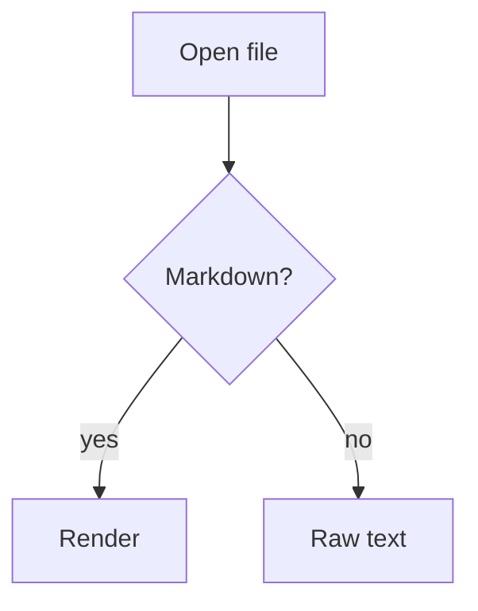

# Sample Document :rocket:

A paragraph with **bold**, *italic*, `inline code`, ~~strikethrough~~, and a
[link to example](https://example.com). This long line exists to confirm that
the readable content width keeps prose comfortable rather than letting it
stretch the full width of the window.

## Code

```js
function greet(name) {
  return `Hello, ${name}!`;
}
```

## Task list (GFM)

- [x] Open a file
- [x] Render with highlighting
- [ ] Toggle raw view
- [ ] Export to PDF

## Math (KaTeX)

Inline: $E = mc^2$. Display:

$$
\int_0^\infty e^{-x^2}\,dx = \frac{\sqrt{\pi}}{2}
$$

## Diagram (Mermaid)



## Callout

::: note
This is a note container — handy for tips and warnings.
:::

## Footnote

Here is a statement that needs a citation.[^1]

[^1]: And here is the footnote text.

## Table

| Feature | Status |
|---------|--------|
| Render  | ✅      |
| Export  | ✅      |

## Quote

> Readability counts.
